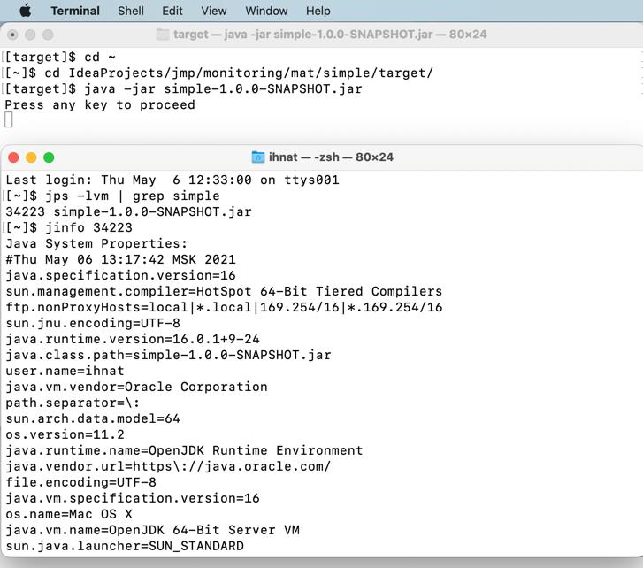

# Monitoring module

---
In `mat` directory you can find applications
   on which monitoring utilities were used.  
Also, there you can find the [Homework](./mat/Homework.md), 
   the tasks of which are solved in the next section below.
___
## Task 1. OutOfMemory (OOM) error troubleshooting
1. Get OOM error
    
1. Use jvisualvm to observe OOM
   
1. Get heap dump
    - Using -XX:+HeapDumpOnOutOfMemoryError option
      
    - [Optional] Using jcmd
      1. 
      1. 
    - [Optional] Using jmap
      1. save PID
      1. 
1. Get heap histogram
    - Using jcmd
      
    - Using jmap
      
1. Analyze heap dump
    - Using Java Visual VM 
      1. File -> Load -> find the heap dump in finder -> Open
      1. 
1. OQL
    - jvisualvm
      1. 
      1. 
      1. 
    - jhat
      1. 
      1. 
      1. 
      1. 
    - The difference in syntax between jvisualvm and jhat are:
          1. select in java.lang.Object mess
            - jhat - `[Ljava.lang.Object;`
            - visualvm - `java.lang.Object[]`
---
## Task 2. Deadlock troubleshooting
1. Get deadlock
   
1. Get thread dump
   1.jstack
   
   1. kill -3 - _don't work for me, so I have just closed by `control+C`_
   
   1. jvisualvm
   
   1. Windows (Ctrl + Break) - _I'm using macOS, so as far as I got `control+C` for me_
   
   1. jcmd
   
---
## Task 3. Remote JVM profiling
1. Run application insecure remote connection
   
1. Connect to JVM using jconsole
   
---
## Task 4. FlightRecorder
1. Execute JVM with two special parameters
   
   On my macbook I have OpenJdk 16, so here I don't need to add `-XX:+UnlockCommercialFeatures` parameter.
   Also, I don't need to use `-XX:+FlightRecorder` option, because `-XX:StartFlightRecording` parameter, as far as I got, include it in OpenJdk
   About `FlightRecording` function in OpenJdk you can read [here](https://habr.com/ru/company/krista/blog/532632/)
1. Enable Flight Recording on JVM without these parameters
   
1. Open Java Mission Control and connect to default HotSpot of our JVM
   1. Open Zulu Mission Control
   
   1. Open saved Flight Recording file in ZMC (Zulu Mission Control)
   
---
## Task 5. jinfo
Print system properties and command-line flags that were used to start the JVM
   
___