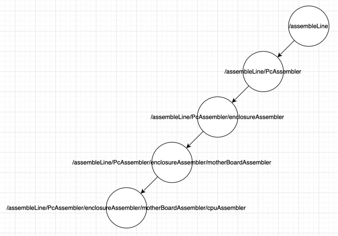

# Task 5 (Optional)
___
Below you can find original task with my small notes.
1. <mark>Done</mark> - it means that this task point has successfully passed.
1. My small descriptions you with see in boxes as below
   > I'm the box
___
## Task description

Please, complete the following task: __PC Assembly Line with Akka__

Automatize PC assembly line with Akka Framework (use Java API).

Requirements:
- <mark>Done</mark>: Create PC object and fill it with data from operation to operation.
  > In my solution I provided map of details, and assemblers have just 
  > set the detail in PC.
  > Data class for PC is [PC.java](./src/main/java/com/epam/learn/multithreading/pclineassembler/entity/PC.java)
- <mark>Done</mark>: Make more than 2 levels-hierarchy of actors.
  > Actors levels-hierarchy I have provided below as image.
- <mark>Done</mark>: Log all steps and meta info about Self and Sender with AkkaLogger.
  

- <mark>Done</mark>: Create 1 actor (or more) for each step of process and 1 router to route all requests for assembling.
  > I'm using the router when create [AssemblyLine.java](src/main/java/com/epam/learn/multithreading/pclineassembler/actor/AssemblyLine.java)
  > actor. 
- <mark>Done</mark>: Write Service layer with CompletableFutures in signatures (handle router answers or inbox events) where it is possible.
  > The Service layer implementation you can find in [PcServiceImpl.java](src/main/java/com/epam/learn/multithreading/pclineassembler/service/PcServiceImpl.java)
- <mark>Done</mark>: Provide client code to call Service layer methods (your choice).
  > Client code you can find in [Main.java](src/main/java/com/epam/learn/multithreading/pclineassembler/Main.java)
- <mark>Done</mark>: Try with different dispatchers and pick one for your solution.
  > my dispatcher have described in [application.conf](src/main/resources/application.conf)
- <mark>Done</mark>: Tune ForkJoin executor for your environment (change configuration).
  > I have just played :)
- <mark>Skipped</mark>: The choice should be based on performance tests *
- <mark>Skipped</mark>: Throughput of assembly line should be more than 100 000 assembled PCs per second *
- <mark>Skipped</mark>: Throughput of assembly line should be more than 1 000 000 assembled PCs per second *
  > __About skipped parts__. Tried to find some performance tests, but I failed.
  > I have found one interesting dependency, but that was good for scala and 
  > thought for java. After this I have started to thing about original solution,
  > but unfortunately, I had no time to implement this. It sounds like this (next section) 
  
  > Create class __Tuner__. This class will launch the actor system in a loop,
  > but everytime with different parameters. At the end of loop when we have
  > a result time we will recalculate dispatcher parameters based on the derivative.
- \* optional points.
An example of actions is described in [this paper](http://techreport.com/review/23624/how-to-build-a-pc-the-tech-report-guide).
  
## Solution 

### Agenda 
- Task understanding
- Actor model

#### Task understanding
First, I wrote all actions from [this paper]().   
Next I tried to map all actions on actors.  
Last, I tried to separate by time of execution.  
As a result a got the table
```text
|--|--------|--------------------------|----------------------------------------|
| #|sequence|     actor name           |             operations                 |
|--|--------|--------------------------|----------------------------------------|
| 1|    1   |  scene: assembly line    |    ->  Setting the stage;              |
| 2|        |                          |        Make sure the parts match       |
|--|--------|--------------------------|----------------------------------------|
| 3|    2   |  motherBoard assembler   |    ->  Seating the memory              |
|--|--------|--------------------------|----------------------------------------|
| 4|    2   |  cpu assembler           |    ->  Priming the processor           |
| 5|        |                          |        Affixing the cooler             |
|--|--------|--------------------------|----------------------------------------|
| 6|    3   |  motherBoard assembler   |    ->  Installing the CPU              |
|--|--------|--------------------------|----------------------------------------|
| 7|    2   | enclosure part assembler |    ->  Preparing the enclosure         |
| 8|        |                          |        Making sense of all the screws  |
| 9|        |                          |        Hard drive and SSD installation |
|10|        |                          |        Adding an optical drive         |
|11|        |                          |        Swapping a fan                  |
|--|--------|--------------------------|----------------------------------------|
|12|    4   | enclosure part assembler |    ->  Inserting the motherboard       |
|13|        |                          |        Graphics time                   |
|14|        |                          |        Another expansion card          |
|15|        |                          |        Moar power                      |
|16|        |                          |        Connecting cables               |
|17|        |                          |        One more thing: Liquid cooling  |
|--|--------|--------------------------|----------------------------------------|
|18|    5   |  PC assembler            |    ->  Plugging peripherals            |
|19|        |                          |        Firmware tweaks                 |
|20|        |                          |        Installing the OS and drivers   |
|--|--------|--------------------------|----------------------------------------|
```
Where
- __\#__. is just counter for operation
- __sequence__. demonstrate the sequence of operations. Same
  numbers means that this will occur simultaneously
- __actor name__. The name of actor that will do this operation 
- __operations__. Operation that should be done.
  Operations in one block should be executed from
  top to button consequently.

#### Actor model
