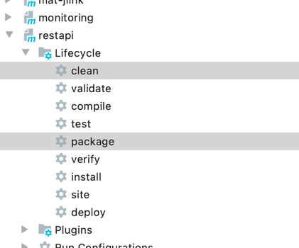
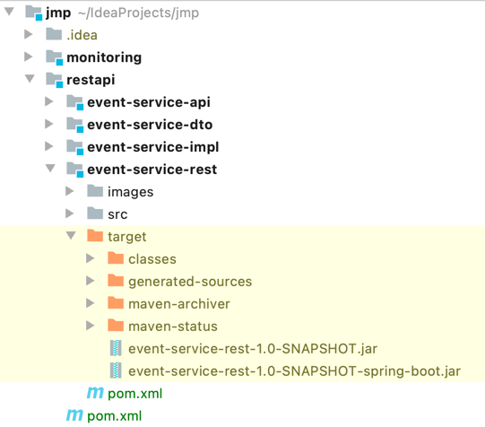
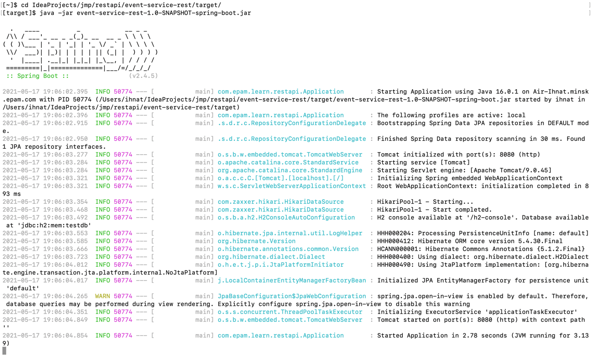
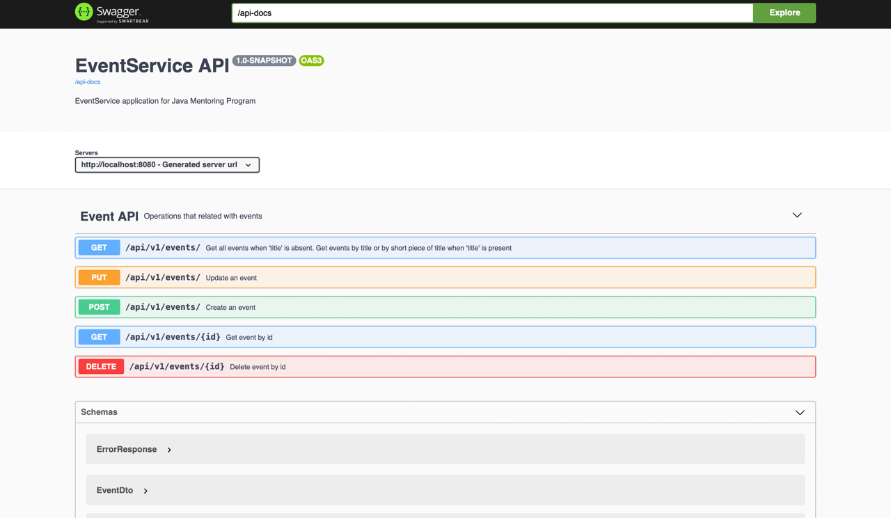

# REST API - Architecture module

___
In scope of this module I have implemented Main task.  
Below you can find original task with my small notes.  
1. <mark>Done</mark> - it means that this task point has successfully passed.  
1. My small descriptions you with see in boxes as below
   > I'm the box
___

## Main task

Description

1. <mark>Done</mark>: Download Java SE Development Kit 8 according to your OS and processor’s architecture.

2. <mark>Done</mark>: Install Java Development Kit according to JDK installation instructions (see also PATH and CLASSPATH).

3. <mark>Done</mark>: Download Apache Maven 3.6.0 according to your OS and processor’s architecture.

4. <mark>Done</mark>: Install Apache Maven according to installation instructions.

5. <mark>Done</mark>: Create maven project with 4 modules:
   - event-service-api;
   - event-service-dto; 
   - event-service-impl; 
   - event-service-rest.
   > The result you can find in current directory and in [pom.xml](./pom.xml) of main maven project
   
6. <mark>Done</mark>: event-service-dto module should contain Event class with following fields:
   - id;
   - title;
   - place;
   - speaker;
   - eventType;
   - dateTime.
   > The result you can find in [Event.java](./event-service-dto/src/main/java/com/epam/learn/restapi/dto/Event.java)
   
7. <mark>Done</mark>: event-service-api module should contain EventService interface with following methods:
   - createEvent(…);
   - updateEvent(…);
   - getEvent(…);
   - deleteEvent();
   - getAllEvents();
   - getAllEventsByTitle(…).
   > The result you can find in [EventService.java](./event-service-api/src/main/java/com/epam/learn/restapi/service/EventService.java)
   
8. <mark>Done</mark>: event-service-impl module should contain EventServiceImpl which implements EventService interface and responds with
   list of Events.
   > The result you can find in [EventServiceImpl.java](./event-service-impl/src/main/java/com/epam/learn/restapi/service/EventServiceImpl.java)
   
   Note: feel free to use any database (filesystem, any db, in memory storage).
   
   > I decide to use h2 embedded database. I have launched it with [data.sql](./event-service-impl/src/main/resources/data.sql) and [schema.sql](./event-service-impl/src/main/resources/schema.sql),
   > using [EventRepository.java](./event-service-impl/src/main/java/com/epam/learn/restapi/repository/EventRepository.java) with [application.yml](./event-service-rest/src/main/resources/application.yml) configuration.
   
9. <mark>Done</mark>: event-service-rest module should contain EventServiceController which provides REST API interface according to 2nd or
   3rd level of REST API maturity and responds with list of Events.
   > The result you can find in [EventServiceController.java](./event-service-rest/src/main/java/com/epam/learn/restapi/controller/EventServiceController.java)
   
10. <mark>Done</mark>: Document methods in EventServiceController using Swagger 2 annotations.
   > The result you can find in [EventServiceController.java](./event-service-rest/src/main/java/com/epam/learn/restapi/controller/EventServiceController.java). 
   
   > In this project I decide to use OpenAPI 3.0.0 (this is renamed Swagger 3) because it is up-to-date version.
   
   > The configuration for OpenAPI you can find in [OpenApiDocsConfig.java](./event-service-rest/src/main/java/com/epam/learn/restapi/config/OpenApiDocsConfig.java).
   > The project name, project description and project version I'm retrieving from [pom.xml](./event-service-rest/pom.xml) in [application.yml](./event-service-rest/src/main/resources/application.yml)

11. <mark>Done</mark>: Implement Application class with @SpringBootApplication annotation and main method.
   > The result you can find in [Application.java](./event-service-rest/src/main/java/com/epam/learn/restapi/Application.java)

12. <mark>Done</mark>: Create runnable Spring Boot JAR with dependencies using spring-boot-maven-plugin.
   > The result you can find in `<build>` section of [pom.xml](./pom.xml)

   > Run maven build 
   > 
   
   > Maven build result
   > 

13. <mark>Done</mark>: Run event-service jar using SpringBoot and Analyse REST API with Swagger UI.
   > Result of launching the app via command line
   > 

   > Swagger UI
   > 
   
   > Generated definition is accessible on `/api-docs` endpoint accordingly [application.yml](./event-service-rest/src/main/resources/application.yml),
   > I have saved in [event-service-api.yaml](./generated/event-service-api.yaml)

14. <mark>Done</mark>: Provide sample requests to EventService, demonstrate it’s work using Swagger UI.
   > Gif image of the request via swagger to event-service
   > 

Note: (<mark>Done too</mark>) implement REST APIs according to all Richardson Maturity Level as additional task.
> The result you can find in [EventServiceController.java](./event-service-rest/src/main/java/com/epam/learn/restapi/controller/EventServiceController.java)